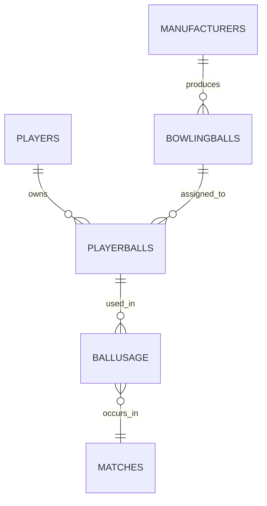

# Collegiate Bowling Team ER Diagram

Players
| **Field**     | **Data Type**                                  | **Key** | **Description**                   |
| ------------- | ---------------------------------------------- | ------- | --------------------------------- |
| **player_id** | INT                                            | **PK**  | Unique identifier for each player |
| first_name    | VARCHAR(50)                                    |         | Player’s first name               |
| last_name     | VARCHAR(50)                                    |         | Player’s last name                |
| email         | VARCHAR(100)                                   |         | Player’s contact email            |
| year          | ENUM('Freshman','Sophomore','Junior','Senior') |         | Academic year                     |
| position      | VARCHAR(50)                                    |         | Player’s team position or role    |

Manufacturers
| **Field**           | **Data Type** | **Key** | **Description**                 |
| ------------------- | ------------- | ------- | ------------------------------- |
| **manufacturer_id** | INT           | **PK**  | Unique ID for each manufacturer |
| name                | VARCHAR(100)  |         | Manufacturer name               |
| country             | VARCHAR(50)   |         | Country of origin               |
| contact_email       | VARCHAR(100)  |         | Manufacturer contact email      |

BowlingBalls
| **Field**           | **Data Type**                      | **Key**    | **Description**                                 |
| ------------------- | ---------------------------------- | ---------- | ----------------------------------------------- |
| **ball_id**         | INT                                | **PK**     | Ball Identifier                                 |
| name                | VARCHAR(100)                       |            | Ball model name                                 |
| **manufacturer_id** | INT                                | **FK**     | Linked to `MANUFACTURERS.manufacturer_id`       |
| purchase_date       | DATE                               |            | Date the ball was purchased                     |
| rg                  | DECIMAL(4,3)                       |            | Radius of gyration                              |
| diff                | DECIMAL(4,3)                       |            | Differential value                              |
| color               | VARCHAR(50)                        |            | Ball color or finish                            |
| core_type           | VARCHAR(50)                        |            | Type of core (symmetrical/asymmetrical)         |
| coverstock          | VARCHAR(50)                        |            | Cover material (reactive resin, urethane, etc.) |
| weight              | DECIMAL(4,1)                       |            | Ball weight in pounds                           |
| status              | ENUM('Active','Retired','Damaged') |            | Ball’s current status                           |

PlayerBalls
| **Field**         | **Data Type** | **Key** | **Description**                         |
| ----------------- | ------------- | ------- | --------------------------------------- |
| **playerball_id** | INT           | **PK**  | Unique ID for player-ball assignment    |
| **player_id**     | INT           | **FK**  | Linked to `PLAYERS.player_id`           |
| **ball_id**       | INT           | **FK**  | Linked to `BOWLINGBALLS.ball_id`        |

BallUsage
| **Field**         | **Data Type** | **Key** | **Description**                       |
| ----------------- | ------------- | ------- | ------------------------------------- |
| **usage_id**      | INT           | **PK**  | Unique record of ball usage           |
| **playerball_id** | INT           | **FK**  | Linked to `PLAYERBALLS.playerball_id` |
| lane_conditions   | VARCHAR(100)  |         | Lane oil pattern or condition         |
